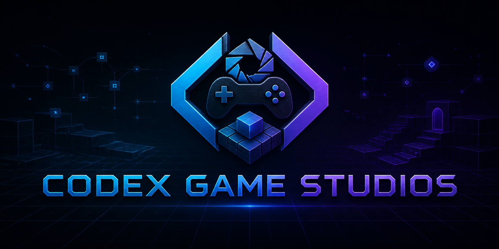

# Codex Game Studios

[English](README.md) | [简体中文](README.zh-CN.md) | [Русский](README.ru.md) | [Deutsch](README.de.md) | [日本語](README.ja.md) | [한국어](README.ko.md)



Codex Game Studios は、
[`donchitos/claude-code-game-studios`](https://github.com/donchitos/claude-code-game-studios)
を基に再構築した、Codex ネイティブのゲーム開発フレームワークです。
元プロジェクトの有用なゲーム開発プロセスを保ちながら、Claude 固有のロール、
モデル階層、フック、コマンドの引き継ぎを、Codex ネイティブの Skill と明確な
エビデンス境界に置き換えています。

このプラグインは、コンセプト策定、ゲームおよび機能設計、技術設計、実装、
デザインとコードのレビュー、QA 計画、プレイテスト分析、制作計画、そして
開発全体のコーディネーションを支援します。技術作業に入る前に、Unity、Unreal、
Godot、ブラウザ、または不明なプロジェクトを判定し、その後で適切な
エンジンアダプターを選択します。

## インストール

Codex CLI でマーケットプレイスを追加し、プラグインをインストールします。

```powershell
codex plugin marketplace add DustSaint/codex-game-studios --ref main
codex plugin add codex-game-studios@codex-game-studios
```

インストール後、新しい Skill を認識させるために新しい Codex タスクを開始してください。

## 使い方

範囲の広いゲーム開発タスクでは、コーディネーターを明示的に呼び出します。

```text
$codex-game-studios:manage-game-development
```

### よく使う呼び出し

| 呼び出し | 用途 |
| --- | --- |
| `$codex-game-studios:brainstorm-game-concept` | ゲームコンセプトの発想 |
| `$codex-game-studios:design-game` | ゲーム全体とシステムの設計 |
| `$codex-game-studios:design-game-feature` | 単一機能の仕様策定 |
| `$codex-game-studios:write-game-technical-design` | 技術設計とアーキテクチャ |
| `$codex-game-studios:implement-game-feature` | 機能実装 |
| `$codex-game-studios:review-game-design` | ゲームデザインレビュー |
| `$codex-game-studios:review-game-code` | ゲームコードレビュー |
| `$codex-game-studios:plan-game-qa` | QA 計画 |
| `$codex-game-studios:analyze-game-playtests` | プレイテスト結果の分析 |
| `$codex-game-studios:plan-game-production` | マイルストーンと制作計画 |

タスクの範囲が明確であれば、自然言語で依頼するだけでも Codex が適切な Skill を
自動的に選択します。

## 対応エンジン

| 実行環境 | 対応内容 |
| --- | --- |
| Unity | 技術設計、機能実装、コードレビュー、エンジンのライフサイクル、検証指針に対応する内蔵アダプター |
| Unreal Engine | 技術設計、機能実装、コードレビュー、エンジンのライフサイクル、検証指針に対応する内蔵アダプター |
| Godot | 技術設計、機能実装、コードレビュー、エンジンのライフサイクル、検証指針に対応する内蔵アダプター |
| ブラウザゲーム | ブラウザプロジェクトを検出し、フレームワーク固有の作業を、インストール済みの Phaser 2D、Three.js/WebGL、React Three Fiber 用 Game Studio Skill に引き継ぎます |
| 不明または矛盾するマーカー | エンジンを推測せず、中立な状態を保って不足しているプロジェクト情報を確認します |

コンセプト、ゲーム全体、機能の設計は、エンジン制約がプレイヤーから見える挙動を
変えない限り、エンジン非依存で進めます。技術フローではプロジェクトファイルから
エンジンバージョンを特定し、そのバージョンの公式ドキュメントで不安定な API を確認します。

## 安全性とスコープ

- インストールによってゲームプロジェクトが変更されたり、ライフサイクルまたは
  Shell フックが登録されたりすることはありません。
- Commit、Push、デプロイ、ストアへのアップロード、リリースなどの外部操作には、
  ユーザーの明示的な許可が必要です。
- 追跡可能なエビデンスが得られるまで、QA 結果は `NOT RUN` のままです。
  未検証の作業を合格として報告することはありません。
- オプションのプロジェクトガイダンスは、ユーザーが要求した場合にのみコピーされます。
- ブラウザおよび Godot の専門作業は、利用可能であれば別途インストールされた
  公式または専門 Skill に引き継ぎます。利用できない場合は、制約を明示した
  代替フローを使用します。

## リポジトリ構成

- `.agents/plugins/marketplace.json` — Codex マーケットプレイスマニフェスト
- `plugins/codex-game-studios` — 完全なプラグインパッケージ
- `plugins/codex-game-studios/docs/CODEX_MIGRATION_PLAN.md` — Codex への移行マッピング
- `plugins/codex-game-studios/docs/CODEX_PORT_REPORT.md` — 検証およびセキュリティレポート

現在のバージョンは `0.1.0` です。上流コミット
`984023ddac0d5e27624f2baacde6105e45de375f` を基に適応し、MIT License で配布しています。
