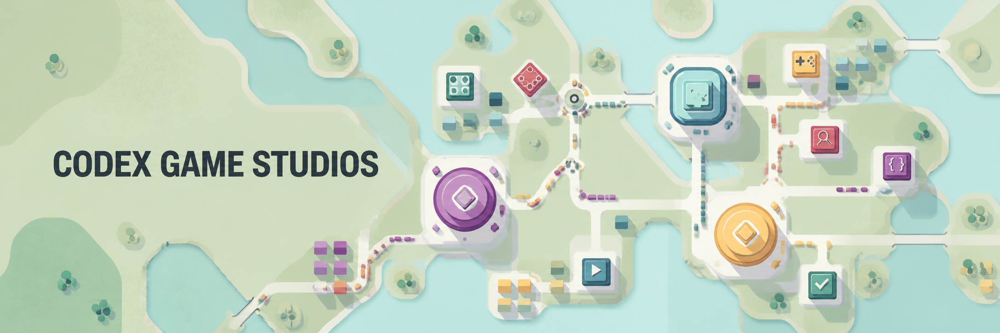

# Codex Game Studios

**Website and multilingual guide:** [dustsaint.github.io/codex-game-studios](https://dustsaint.github.io/codex-game-studios/)



Codex Game Studios is a Codex-native game-development framework adapted from
[`donchitos/claude-code-game-studios`](https://github.com/donchitos/claude-code-game-studios).
It preserves the useful game-development behavior while replacing Claude-specific
roles, model tiers, hooks, and command handoffs with native Codex skills and explicit
evidence boundaries.

The plugin supports concept discovery, game and feature design, technical design,
implementation, design and code review, QA planning, playtest analysis, production
planning, and end-to-end workflow coordination. Technical work detects Unity,
Unreal, Godot, browser, or unknown projects before selecting an engine adapter.

## Install

Install the marketplace and plugin with the Codex CLI:

```powershell
codex plugin marketplace add DustSaint/codex-game-studios --ref main
codex plugin add codex-game-studios@codex-game-studios
```

Start a new Codex task after installation so the new skills are discovered.

## Use

For broad game-development work, call the coordinator explicitly:

```text
$codex-game-studios:manage-game-development
```

### Common invocations

| Invocation | Purpose |
| --- | --- |
| `$codex-game-studios:brainstorm-game-concept` | Game concept ideation |
| `$codex-game-studios:design-game` | Whole-game and systems design |
| `$codex-game-studios:design-game-feature` | Bounded feature specification |
| `$codex-game-studios:write-game-technical-design` | Technical design and architecture |
| `$codex-game-studios:implement-game-feature` | Feature implementation |
| `$codex-game-studios:review-game-design` | Game-design review |
| `$codex-game-studios:review-game-code` | Game-code review |
| `$codex-game-studios:plan-game-qa` | QA planning |
| `$codex-game-studios:analyze-game-playtests` | Playtest feedback analysis |
| `$codex-game-studios:plan-game-production` | Milestones and production planning |

Natural-language requests can trigger the matching skill automatically when its
scope is clear.

## Supported engines

| Runtime | Support |
| --- | --- |
| Unity | Native adapter for technical design, feature implementation, code review, engine lifecycle, and verification guidance |
| Unreal Engine | Native adapter for technical design, feature implementation, code review, engine lifecycle, and verification guidance |
| Godot | Native adapter for technical design, feature implementation, code review, engine lifecycle, and verification guidance |
| Browser games | Detects browser projects and routes framework-specific work to installed Game Studio Skills for Phaser 2D, Three.js/WebGL, or React Three Fiber |
| Unknown or conflicting markers | Remains engine-neutral and requests the missing project evidence instead of guessing |

Concept, game-design, and feature-design work stays engine-agnostic unless an
engine constraint changes player-facing behavior. Technical workflows derive the
engine version from project files and verify unstable APIs against official
documentation for that version.

## Safety model

- Installation does not edit game projects or register lifecycle hooks.
- External actions such as commit, push, deployment, store upload, and release
  require explicit authorization.
- QA results remain `NOT RUN` until evidence exists; unverified work is never
  reported as passed.
- Optional project guidance is copied only when requested.
- Browser and Godot specialist work is handed to separately installed official or
  specialist skills when available, with a graceful fallback when absent.

## Repository layout

- `.agents/plugins/marketplace.json` — Codex marketplace manifest
- `plugins/codex-game-studios` — complete plugin package
- `plugins/codex-game-studios/docs/CODEX_MIGRATION_PLAN.md` — source-to-Codex mapping
- `plugins/codex-game-studios/docs/CODEX_PORT_REPORT.md` — validation and security report

The current release is `0.1.0`, adapted from upstream commit
`984023ddac0d5e27624f2baacde6105e45de375f` and distributed under the MIT License.
